# The Happiness Project
> Created by Adam Lever, Dale Currigan, and Jimmy faccioli  
> April 2021
  
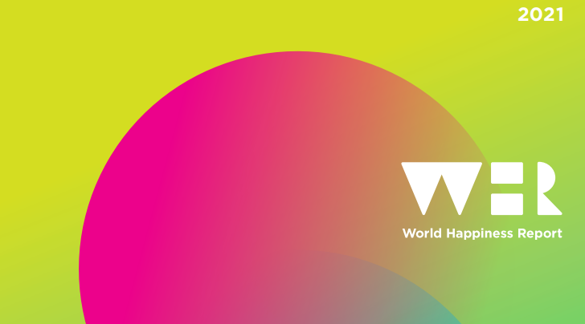    

## Table of contents  
* [Project Intro](#Project-Intro)  
* [Project Structure](#Project-Structure)  
* [Question](#Questions)  
* [Datasets](#Datasets)  
* [Analysis](#Analysis)  
* [Contributors](#Contributors)  
* [Status](#Status)  

# Project Intro

Australia was recently ranked the 11th happiest country in the world according to authors of the 2021 World Happiness Report. The report reviews the state of happiness in the world today. But what makes a person happy and who in world is happy? Not only does the World Happiness Report contain clues that answer these questions, it is increasingly being used by governments, organisations and civil society to inform policy-making decisions and to assess the progress of nations. 

Our analysis will investigate economic, social, environmental and world factors that lead to and contribute to greater happiness. We look at the levels of happiness across the globe and how these levels have changed over time. We also take a look at how the Covid-19 pandemic has affected happiness levels. Finally we take a closer look at how happy Australia is and compare it to the happiness levels of the highest and lowest ranked countries in the World Happiness Report. 


# Project Structure
```
happiness-project 
|__ .gitignore                      # gitignore file  
|__ Python 3                        # conda environment  
|   
|__ data/                           # Contains raw data  
|   |__ country_data.csv                    # Raw data of analysed countries  
|   
|__ covid_data.csv                      # Collected from https://about-corona.net/ using API calls  
|   |__ mental_health.csv                   # Data of common mental disorders from the World Health Organisation  
|   |__ Rainfall_data.csv                   # Historical global rainfall by country from the World Bank  
|   |__ Sunlight_data.csv                   # Global sunlight by country from Kaggle  
|   |__ Temp_data.csv                       # Historical global temperatures by country from the World Bank  
|   |__ World_GDP_1960-2019                 # GDP data from the World Bank  
|   |__ World_GDP_per_capita_1960-2019      # GDP data from the World Bank  
|   |__ world-happiness-report.csv          # From historical World Happiness Reports from 2005 to 2020  
|   |__ world-happiness-report-2021.csv     # From the 2021 World Happiness Report  
|   |__ final_df.csv                        # All raw data, cleaned and collated into the one data frame        
|___  
|   |__ Final Dataframes/           # Raw data collated into dataframes, cleaned & exported into .csv files  
|           |__ afghanistan_happiness.csv       # Created from world-happiness-report-2021.csv  
|           |__ australia_happiness.csv         # Created from world-happiness-report-2021.csv  
|           |__ country_df                      # Created from Sunlight_data.csv  
|           |__ final_covid_data.csv            # Created from world-happiness-report-2021 & covid_data.csv  
|           |__ final_df.csv                    # All raw data, cleaned & collated into the one data frame  
|           |__ final_df2.csv                   # All raw data, cleaned & collated into the one data frame  
|           |__ finland_happiness.csv           # Created from world-happiness-report-2021.csv  
|           |__ happiness_df.csv                # Created from world-happiness-report-2021.csv  
|           |__ happiness_time_final.csv        # Created from world-happiness-report & world-happiness-report-2021.csv  
|           |__ mental_health_data.csv          # Created from world-happiness-report-2021 & mental_health.csv  
|           |__ weather_data.csv                # Created from country_data, Temp_data, Rainfall_data, Sunlight_data & world-happiness-report-2021.csv  
|  
|__ notebooks/  
|   |__ Data Exploration and Clean.ipynb    # Cleaning notebook that takes in the raw data and outputs cleaned data for analysis     
|   |__ Analysis.ipynb                      # Analysis of cleaned data with output of plots and Choropleth maps  
|     
|__ images/                         # Contains plots from jupyter notebook  
|   |__ australia_afghanistan_finland_happiness  
|   |__ australia_happiness  
|   |__ Happiness_2019_GDP  
|   |__ Happiness_2019_GDP_per_Capita  
|   |__ Happiness_2019_GDP_per_Capita_log  
|   |__ Happiness_Corruption  
|   |__ Happiness_Freedom  
|   |__ Happiness_GDP_per_capita  
|   |__ Happiness_Generosity  
|   |__ Happiness_Life_Expectancy  
|   |__ Happiness_Social_Support  
|   |__ happiness_histogram  
|   |__ happiness_hemispheres  
|   |__ happiness_choropleth  
|   |__ regional_happiness  
|   |__ regional_happiness_time  
|   |__ happines_temp  
|   |__ happiness_rainfall  
|   |__ happiness_sunlight  
|   |__ sunlight_GDP  
|   |__ happiness_depression  
|   |__ happiness_anxiety  
|   |__ happiness_covid_cases_pop  
|   |__ happiness_covid_death_rate  
|   |__ covid_depression  
|   |__ covid_GDP  
|   |__ covid_temp  
|     
|__ proposal/  
|   |__ Happiness Proposal     # Project proposal   
``` 
  
# Questions 

1. Who is Happy? 
2. What makes us Happy? 
3. How has the Covid-19 global pandemic affected happiness?
4. How happy are we in Australia?


# Datasets 

|No|Source|Link|
|-|-|-|
|1| World Happiness Report         |https://worldhappiness.report/ed/2021/| 
|2| Kaggle World Happiness Dataset |https://www.kaggle.com/ajaypalsinghlo/world-happiness-report-2021|
|3| The World Bank                 |https://climateknowledgeportal.worldbank.org|  
|4| The World Bank                 |https://data.worldbank.org/indicator/NY.GDP.PCAP.CD|  
|5| World Health Organisation      |https://www.who.int/publications/i/item/depression-global-health-estimates|  
|6| About Corona API               |https://about-corona.net|  
|7| Kaggle Open Source Datasets    |https://www.kaggle.com/datasets|  
|8| Country Demographics           |https://gist.github.com/tadast/8827699|  
|9| Data World                     |https://data.world/https://data.world/makeovermonday/2019w44|   
  
  
# Analysis  
  
### Question 1: Who is Happy?   

The 2021 happiness report reviews the state of happiness in the world today. Data from the report was used in this project to investigate which countries across the globe ranked the happiest and how the state of happiness across the globe has changed since 2005.   
  
At the top of the Happiness Score rankings Finland is ranked the happiest country in the world. At the bottom is Afghanistan, perhaps not to surprisingly given its years of war over past two decades. Western countries, particularly Scandinavian countries, tended to have higher happiness scores with lower happiness scores being found in African, Middle Eastern and South Asian countries. 

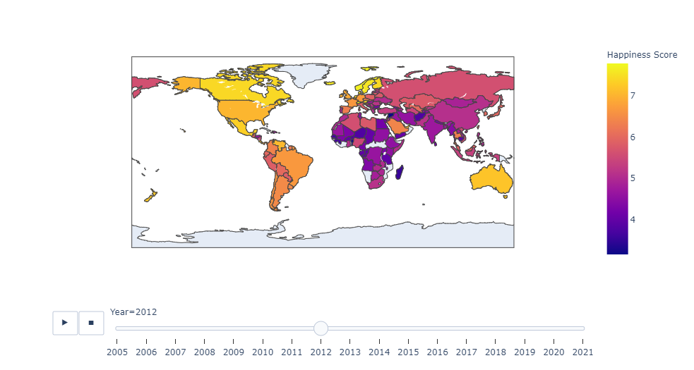  

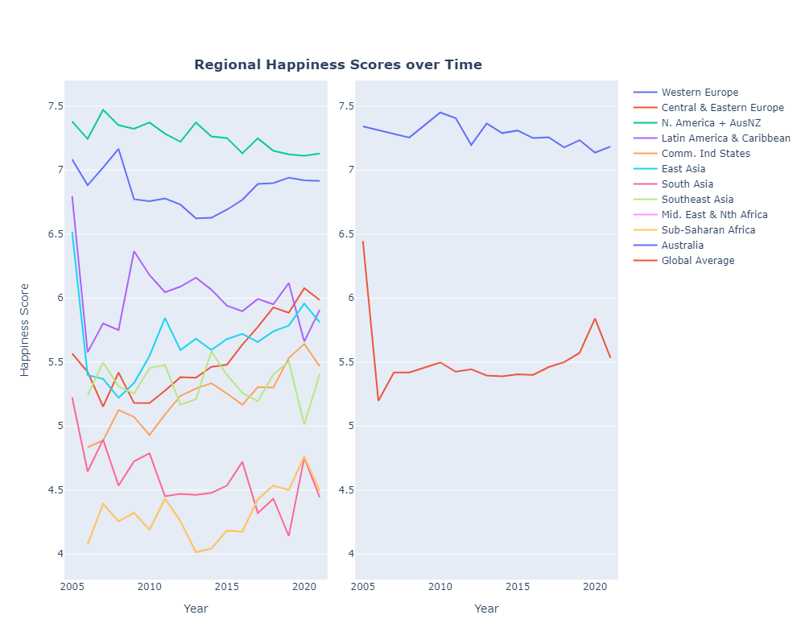  

Happiness is approximately normally distributed across the globe, a t-test showed that the Northern hemisphere is happier that the Southern hemisphere, with this result being statistically significant.    
  
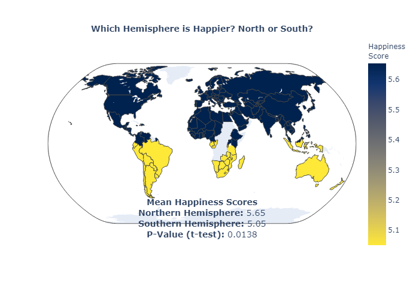  
   
### Question 2: What makes us Happy?   
   
Analysis showed that there are strong positive correlations between Happiness and GDP per Capita, Social Support, Freedom and Life Expectancy. A nations perceived levels of corruption presented a moderate negative correlation to happiness. Developed regions across the world have maintained higher and relatively stable happiness levels over time, with less developed regions exhibiting more volatile levels of happiness.  
  
  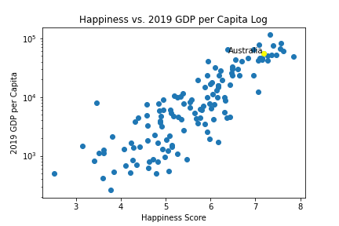  

  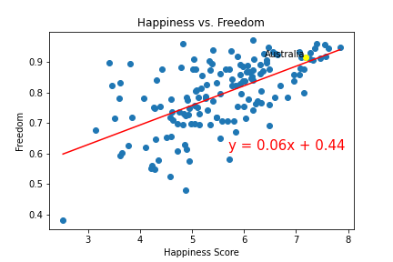  

It was found that a Country’s happiness score is inversely correlated with average yearly temperature and sunlight hours, countries with lower temperatures tend to be happier. However, observing the regional distributions in the data it was hypothesised that this relationship may be due to the fact that the wealthier nations tend to have colder climates, with poorer ones being warmer.  

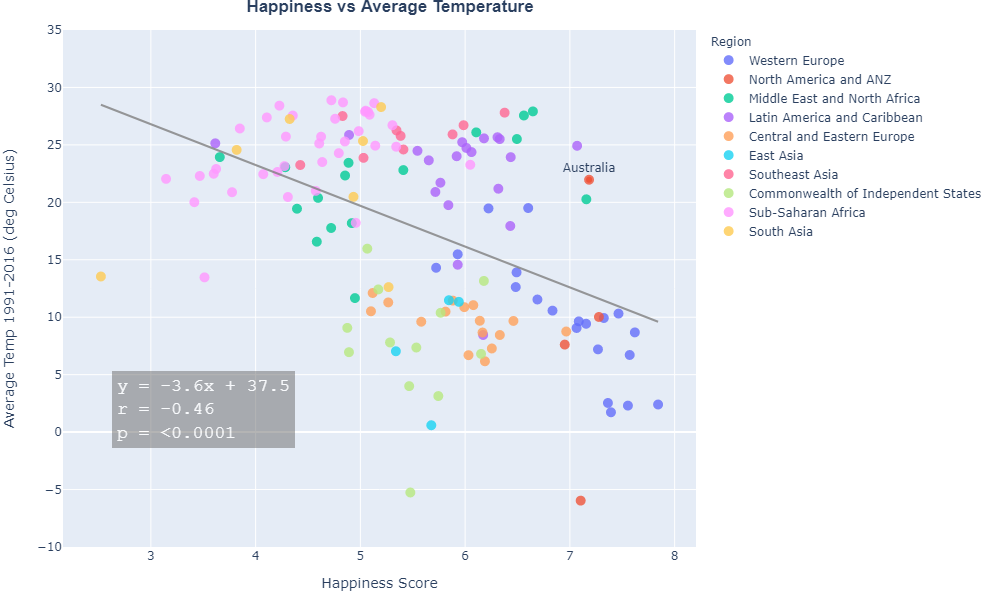  
  
A surprising reslut from the analysis showed that depression and anxiety are more common in nations with higher happiness scored. This may be due to better recognition, reporting and diagnosis of such conditions in developed countries. Mental health is dependent on a complex balance of biopsychosocial factors, therefore disorders such as depression and anxiety still have a high prevalence despite high national happiness scores.  

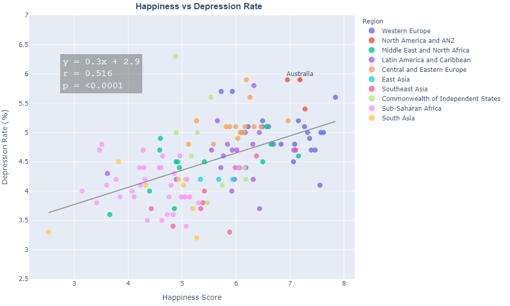  
  
  
### Question 3: How has the Covid-19 global pandemic affected happiness?  
  
From the data analysed the Happiness Score does not have a real influence on the number of covid cases per million of population. However a negative correlation was observed between the covid death rate and happiness score. However, restricted was limited due to data limitations.  

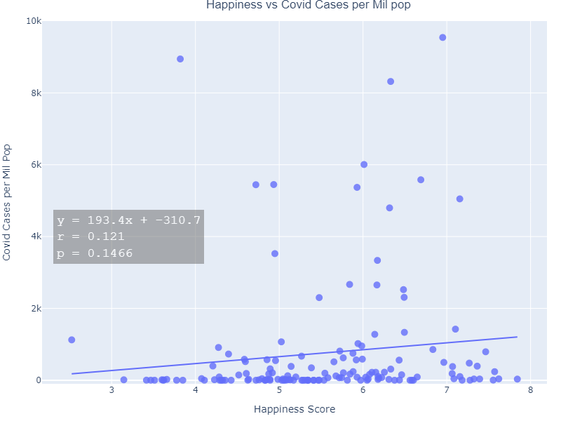  

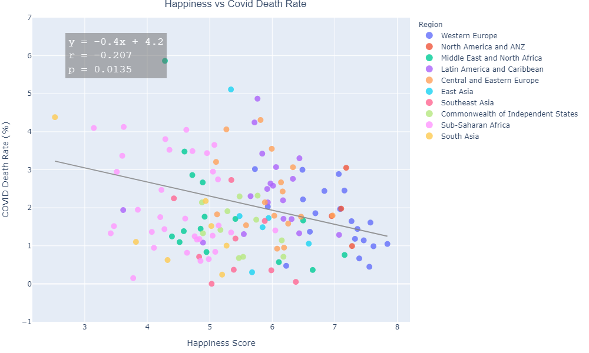  
  
### Question 4: How happy are we in Australia?  
  
Ranking 11 out of the 149 countries included in the report, it would be fair to call Australia one of the happiest nations in the world. However, data also shows that the level of happiness in Australia has shown slight decline since scores 2005.  
  
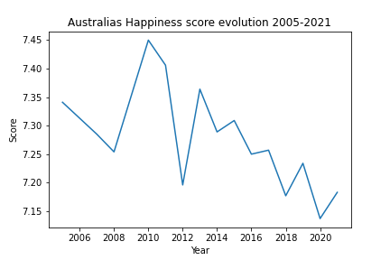 
  
# Contributors  
  
- [@adamlever](https://github.com/adamlever)  
- [@dcurrigan](https://github.com/dcurrigan)  
- [@jfaccioli](https://github.com/jfaccioli)  

## Status
Project is: 
````diff 
+ Completed
````
  
